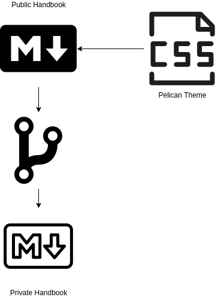

# Data Engineering Handbook

This repo contains the contents of the [harrison.ai](https://harrison.ai) Data Engineering Handbook which is published via GitHub Pages at [https://dataengineering.harrisonai.io](https://dataengineering.harrisonai.io). This handbook describes the standard processes being used by the harrison.ai Data Engineering team and is intended to be a collaborative dynamic document that is contributed to by all members of the data engineering team.  This handbook and the corresponding repo has intentionally been made public for a number of different reasons:

* our hope is that this document may be used by others in the data engineering space as a reference or inspiration for their own methods and processes.
* it can be referred to and used by engineers looking to join the harrison.ai data engineering team, particularly during the interview / recruitment process.
* it is simply easier to access documentation that does not need to be protected via a standard URL.

This handbook is licensed under the [Mozilla Public License](LICENSE) so it can be easily forked and modified without the requirement to contribute back to this project.

# Documentation Structure

This repo has been structured to allow this document to be easily forked and customised for a number of different use cases.  As such there are a few key components and design choices that 
have been made that contributors should be aware of.  
The folder structure is as follows:

```bash
.
├── CNAME
├── content
│   └── pages
│       ├── about.md
│       ├── engineering
│       │   ├── branches.svg
│       │   ├── dev.md
|       │   ├── ... 
│       │   ├── terraform.md
│       │   └── tickettemplate.png
│       └── index.md
├── .github
│   ├── ISSUE_TEMPLATE.md
│   ├── PULL_REQUEST_TEMPLATE.md
│   └── workflows
│       └── main.yml
├── .gitignore
├── .gitmodules
├── LICENSE
├── Makefile
├── PAGE_TEMPLATE.md 
├── pelicanconf.py
├── pelican-theme
│   ├── LICENSE
│   ├── README.md
│   ├── static
│   │   ├── css/
│   │   └── images/
│   └── templates
│       └── base.html
├── plugin.py
├── publishconf.py
├── README.md
├── requirements.txt
└── tasks.py
```

As the handbook is built using the [Pelican](https://docs.getpelican.com/en/latest/) static site generator, the content of the handbook is to be written using [markdown](https://www.markdownguide.org/) and placed in the **content** directory.
If you wish to use a sub-directory to logically group content you can do that too, just ensure you have an **index.md** file in the sub-directory as the main page or index page for the group.

The other key component of this structure is the **pelican-theme** directory, or in this case a [git submodule](https://git-scm.com/book/en/v2/Git-Tools-Submodules).  The theme is installed as a git submodule as it allows for the theming and styling decisions within the handbook to be changed easily if one wishes to create a fork of the handbook and apply their own custom theming. 
The [Pelican theme](https://docs.getpelican.com/en/4.6.0/pelican-themes.html) used in this repository can also be found [in this repository](https://github.com/harrison-ai/pelican-theme).
While this handbook uses Pelican to create the static pages for the site, it does not implement the blog post article functionality but rather relies on the use of Pages as we are currently not generating blog posts.

### Private Documentation
In some instances there may be a need to keep some content private, but not maintain two distinct copies.  In this case it is recommended that a fork of the public handbook be made and be used as the upstream source.  In that way the private content can be added to the **content** folder of the fork using either different filenames or sub-directories.
If an update is made to the public repository then the changes can equally be applied to the downstream fork simply by rebasing or pulling from upstream.




# Development

If you do not intend to serve or view the content of this handbook locally, but rather write and submit content then all you need is git and a text editor to draft the markdown documentation.
To make a new page copy and rename the file **PAGE_TEMPLATE.md** and paste it into the **content** directory.  When renaming the file, remember if you are using a sub-directory you will need at least one copy of the **PAGE_TEMPLATE.md** to be named **index.md**.

If you wish to serve a local copy to look at your changes as they are made you will need to have [Python 3.6 or later](https://www.python.org/) installed.  It is recommended that you create a [virtual environment](https://docs.python.org/3/tutorial/venv.html) to install the dependencies listed in the **requirements.txt** file.


```bash
$ python3 -m venv dataeng-handbook
$ source ./dataeng-handbook/bin/activate
(dataeng-handbook) $ pip install -r requirements.txt
```

Once you have the dependencies installed you can simply launch the dev server.

If you have Make installed:

```bash
(dataeng-handbook) $ make devserver
"pelican" -lr "./content" -o "./output" -s "./pelicanconf.py" 
  --- AutoReload Mode: Monitoring `content`, `theme` and `settings` for changes. ---

Serving site at: http://127.0.0.1:8000 - Tap CTRL-C to stop

-> Modified: settings, content, theme, [static]pages, [static]pages/engineering. re-generating...
Done: Processed 0 articles, 0 drafts, 5 pages, 0 hidden pages and 2 draft pages in 0.16 seconds.
```

You can then launch a browser window at this address: [http://127.0.0.1:8000](http://127.0.0.1:8000).  It is recommended you use a private browser window to avoid any changes not being applied due to a previous cache.


If you don't have Make installed, simply run:
```bash
(dataeng-handbook) $ pelican -lr ./content -o ./output -s ./pelicanconf.py 
  --- AutoReload Mode: Monitoring `content`, `theme` and `settings` for changes. ---

Serving site at: http://127.0.0.1:8000 - Tap CTRL-C to stop

-> Modified: settings, content, theme, [static]pages, [static]pages/engineering. re-generating...
Done: Processed 0 articles, 0 drafts, 5 pages, 0 hidden pages and 2 draft pages in 0.16 seconds.
```

## Static Images and Linking to Other Files

If you want to link to another page in the handbook in your content, you use the following magic 🪄 incantation:

```markdown
[text within the link]({filename}anotherpage.md)
```

This is a standard syntax for creating links within pages in Markdown.  If you are familiar with Markdown you will notice a special `{filename}` tag, this is used by pelican to determine the filepath of the destination page when creating the site.  You can also link to external sites using a similar notation:

```markdown
[text within the link](http://www.somesite.com)
```

The following document extracts demonstrate the usage of these tags:

```
processes.  The information in this section is intended to both serve as a means of standardising and making our work more efficient, as well as a way to effective on-board new team members.  If there are aspects of this documentation and processes that need to change we should discuss potential changes and make proposals and requests via a [pull request](https://github.com/harrison-ai/dataeng-handbook/pulls). 

## Contents
* [Development Processes]({filename}dev.md)
* [Source Control Processes]({filename}source.md)
```

If you want to include an image in your page you simply need to put a copy of the image in the same directory as the page you are writing. Once the image is in that location you can include it in your markdown document using the following: 

```markdown

```

The following document extract shows how to include an image.

```markdown
In the below image are some examples of relative sizing and its estimation points to develop following vehicles: Difficulty could be related to complexities, risks, and efforts involved. Story points are a unit of measure for expressing an estimate of the overall effort that will be required to fully implement a product backlog item or any other piece of work.


```

Again if you are familiar with Markdown you will notice the `{attach}` tag, this is used by Pelican to determine the final location of the image in the generated site.

# Contributions

If you would like to contribute, please feel free to fork this repo and submit a [pull request](https://github.com/harrison-ai/dataeng-handbook/pulls).  Note that while the harrison.ai pelican theme is available on github many of the assets in the repo are under copyright protection.